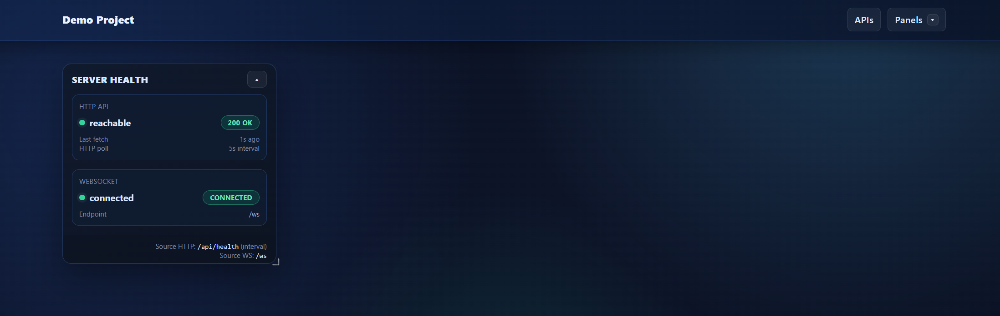
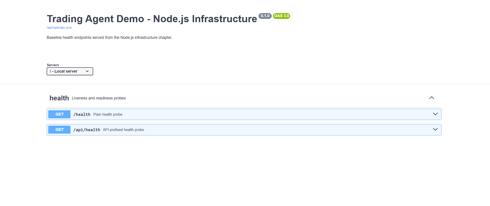

<!-- README.md -->
# Trading Agent Demo

Minimal HTTP + WebSocket baseline in TypeScript:
- Fastify HTTP server with `/health` and `/api/health`
- Socket.IO transport attached to the same server
- Vite + React dashboard with a Health panel (HTTP poll + WS status); panels live in a draggable grid, can be shown/hidden, and collapse/expand
- UI layout in-memory persistence under `/api/ui/layout` so panel positions/sizes survive F5

*Dashboard with ServerHealth panel and draggable grid.*

*Interactive API docs page (OpenAPI/Swagger).*

## Chapters
- [Trading Agent Demo (Node.js Infra)](#trading-agent-demo-nodejs-infra)
  - [Chapters](#chapters)
  - [Project status](#project-status)
  - [Docs](#docs)
  - [Getting started](#getting-started)
  - [Smoke tests](#smoke-tests)
    - [nodejs\_infrastructure](#nodejs_infrastructure)
    - [states](#states)
  - [Production build \& serve](#production-build--serve)
  - [Docker (one-port API/WS + frontend)](#docker-one-port-apiws--frontend)
  - [Scripts](#scripts)

## Project status
This demo is an early baseline extracted from a larger, real-world project. It does not yet include the trading-agent domain logic, but it already reflects the architecture, workflow, and engineering standards used in the full build (HTTP/WS contracts, UI patterns, testing approach, and documentation style).

## Docs
- [Tech stack](docs/public/00_overview/00_tech_stack.md)
- [Tooling](docs/public/00_overview/01_tooling.md)
- [Node.js infrastructure](docs/public/01_nodejs_infrastructure/00_nodejs_infrastructure.md)
- [States (health + UI layout)](docs/public/02_states/00_states.md)

## Getting started
Prereq: Node.js 20.11.1 (nvm-windows: `nvm install 20.11.1` then `nvm use 20.11.1`)
1. Install deps: `npm install`
2. Env: copy `.env.example` to `.env` (defaults use port 3000, log level `info`, WS path `/ws`)
3. Start backend (dev): `npm run start`
4. Start frontend (dev, separate terminal): `npm run dev:frontend` (opens Vite on 5173; API/WS base defaults to `http://localhost:3000`)

## Smoke tests

### nodejs_infrastructure
- Default spawns backend itself; set `SMOKE_SPAWN_BACKEND=false` to reuse a running one.
- Run: `node scripts/tests/smoke/01_nodejs_infrastructure/00_health.smoke.js`
- Checks: HTTP `/health` + `/api/health` shape, WS connect, static frontend (`/` and first asset).
- Output: [00_health.smoke.result.json](scripts/tests/smoke/01_nodejs_infrastructure/00_health.smoke.result.json)

### states
- Requires a frontend build for UI steps (`npm run build`); set `SMOKE_UI=false` to skip UI and just check APIs.
- Default spawns backend itself; set `SMOKE_SPAWN_BACKEND=false` to reuse a running one.
- Run: `node scripts/tests/smoke/02_states/00_state_snapshot.smoke.js`
- Checks: `/api/health`, `/api/ui/layout`, and UI drag/collapse/hide/reload persistence.
- Output: [00_state_snapshot.smoke.result.json](scripts/tests/smoke/02_states/00_state_snapshot.smoke.result.json)

## Production build & serve
- Build frontend + type-check: `npm run build` (outputs to `dist/frontend`)
- Serve built frontend + backend on `http://localhost:3000`: `npm run start:prod`
- In prod mode, the backend serves the built dashboard at `/` and assets under `/assets/`.

## Docker (one-port API/WS + frontend)
- Build image: `docker build -t trading-agent-demo .`
- Run: `docker run --rm -p 3000:3000 --env PORT=3000 trading-agent-demo`
- Open: `http://localhost:3000/` (UI) and `http://localhost:3000/api/health`

## Scripts
- `npm run start`: backend HTTP + Socket.IO
- `npm run dev:backend`: backend with reload (tsx watch)
- `npm run dev:frontend`: Vite dev server
- `npm run dev`: run backend + frontend together
- `npm run build`: type-check + Vite build
- `npm run start:prod`: build + run backend serving the built frontend
